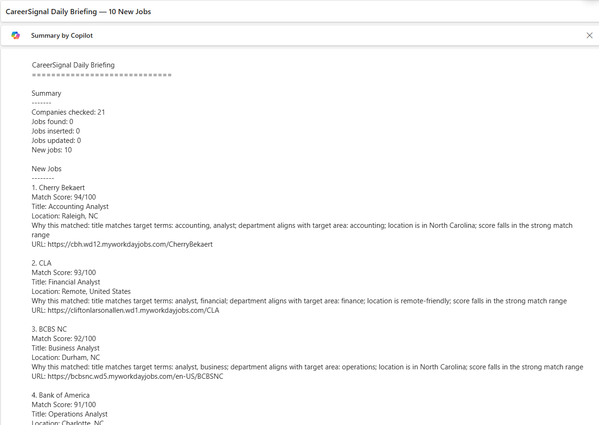
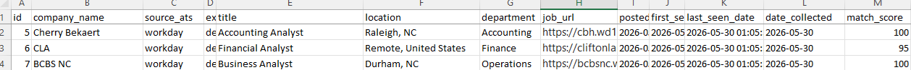
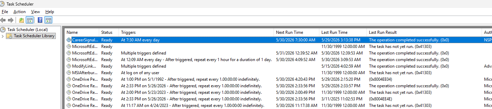

# CareerSignal

[](https://github.com/nepounds/CareerSignal/actions/workflows/tests.yml)

CareerSignal is a Python/SQL career intelligence pipeline that monitors target company career pages, collects job postings, stores results in SQLite, scores job fit, sends daily email reports, exports Excel reports, and supports Power BI dashboard reporting.

The project was built as a portfolio project to demonstrate practical Python, SQL, automation, reporting, and business analysis skills.

## Project Purpose

Most job searching is manual, repetitive, and easy to miss. CareerSignal was built to reduce that manual work by checking selected company career pages and surfacing roles that match a defined search strategy.

CareerSignal does not try to scrape every company on the internet. Instead, it uses a controlled company configuration file and supports only career platforms that the project can handle reliably.

The current version supports:

* Greenhouse
* Workday

Other ATS platforms and manual-only career pages are tracked in an ATS audit file for future improvement.

## What CareerSignal Does

CareerSignal can:

* Read target companies from a CSV configuration file
* Collect jobs from supported Greenhouse and Workday career pages
* Normalize job data into a consistent format
* Store job records in a local SQLite database
* Avoid duplicate job records
* Track first-seen and last-seen dates
* Detect jobs first seen in the past 24 hours
* Score jobs based on target titles, keywords, locations, and role fit
* Send a daily email report
* Include failed sources in the report
* Export job data to Excel
* Feed a Power BI dashboard
* Run automatically with Windows Task Scheduler
* Separate supported companies from unsupported/manual-only companies through an ATS audit
* Run automated tests and lint checks through GitHub Actions

## How It Works

```text
Windows Task Scheduler
→ run_careersignal_daily.bat
→ Python collection runner
→ Greenhouse / Workday collectors
→ normalized job records
→ SQLite database
→ new job detection
→ match scoring
→ daily email report
→ Excel export
→ Power BI dashboard
```

## Pipeline Overview

### 1. Company Configuration

The live company configuration is stored in:

```text
config/company_config.csv
```

This file includes only companies that CareerSignal is currently designed to collect from.

Current supported ATS types:

```text
greenhouse
workday
```

Unsupported platforms are intentionally kept out of the live config so the daily automation stays stable.

### 2. Job Collection

The main collection runner is:

```text
scripts/collect_greenhouse_jobs.py
```

The filename still references Greenhouse because the project started there, but the runner now supports both Greenhouse and Workday sources.

Preview mode:

```powershell
python scripts/collect_greenhouse_jobs.py --preview
```

Send mode:

```powershell
python scripts/collect_greenhouse_jobs.py --send
```

### 3. Data Normalization

Each collector returns jobs in a standard format:

```python
{
    "company_name": str,
    "source_ats": str,
    "external_job_id": str,
    "title": str,
    "location": str,
    "department": str,
    "job_url": str,
    "posted_date": str,
    "date_collected": str,
}
```

This lets the rest of the pipeline process Greenhouse and Workday jobs the same way.

### 4. SQLite Database

CareerSignal stores collected jobs in:

```text
data/careersignal.db
```

The database supports:

* Job storage
* Duplicate prevention
* First-seen tracking
* Last-seen tracking
* New job detection
* Match scoring support
* Excel and Power BI reporting

The project does **not** use:

```text
data/jobs.db
```

### 5. New Job Detection

CareerSignal tracks when each job was first seen.

The daily report is designed to focus on jobs first seen in the past 24 hours, instead of repeatedly sending the same jobs every day.

### 6. Match Scoring

CareerSignal scores jobs based on how well they fit the target search strategy.

The scoring system is not limited to accounting roles. It supports several realistic job lanes, including:

* Accounting roles
* Finance roles
* General analyst roles
* Business analyst roles
* Operations analyst roles
* Compliance analyst roles
* Data/reporting analyst roles
* Plant supervisor roles
* Operations supervisor roles
* Water/wastewater or utility-adjacent roles

Suggested score bands:

```text
80-100: Strong match
60-79: Possible match
40-59: Weak/stretch match
0-39: Low match or likely skip
```

### 7. Daily Email Report

CareerSignal can send a daily email report containing:

* Summary of the run
* Number of companies checked
* Number of jobs found
* Number of new jobs
* Match scores
* Why a job matched
* Job URLs
* Failed sources, if any

The email report is sent through SMTP using local `.env` settings.

The `.env` file is not committed to GitHub.

### 8. Excel Export

CareerSignal exports job data to:

```text
exports/careersignal_export.xlsx
```

Export command:

```powershell
python scripts/export_to_excel.py
```

The Excel export is used as the Power BI data source.

### 9. Power BI Dashboard

The Power BI dashboard is stored in:

```text
reports/careersignal_dashboard.pbix
```

The dashboard uses:

```text
exports/careersignal_export.xlsx
```

Power BI Desktop requires manual refresh unless the report is published and configured for scheduled refresh separately.

Manual refresh:

```text
Home > Refresh
```

### 10. Daily Automation

CareerSignal can run automatically through Windows Task Scheduler.

The batch file is:

```text
run_careersignal_daily.bat
```

The scheduled task runs the collection script and Excel export so the pipeline can update daily without manually running each command.

## Screenshots

Screenshots use sample/demo output generated from the CareerSignal pipeline. Private credentials, local database files, logs, and real email settings are excluded from the repository.

### Power BI Dashboard


### Daily Email Report



### Excel Export



### Task Scheduler Setup



## Project Structure

```text
CareerSignal/
├── config/
│   ├── company_config.csv
│   └── company_ats_audit.csv
├── data/
│   └── .gitkeep
├── docs/
│   ├── CareerSignal_Project_State.md
│   ├── filtering_strategy.md
│   └── screenshots/
├── exports/
│   └── .gitkeep
├── logs/
│   └── .gitkeep
├── reports/
│   └── careersignal_dashboard.pbix
├── .github/
│   └── workflows/
│       └── tests.yml
├── scripts/
│   ├── collect_greenhouse_jobs.py
│   ├── export_to_excel.py
│   ├── generate_company_config_from_audit.py
│   ├── preview_workday_jobs.py
│   ├── test_config_loader.py
│   ├── test_database.py
│   ├── test_email_report.py
│   ├── test_match_scoring.py
│   └── verify_ats_audit.py
├── src/
│   └── careersignal/
│       ├── config_loader.py
│       ├── database.py
│       ├── email_report.py
│       ├── logging_config.py
│       ├── match_scoring.py
│       └── collectors/
│           ├── greenhouse.py
│           └── workday.py
├── tests/
│   ├── test_email_report.py
│   └── test_match_scoring.py
├── run_careersignal_daily.bat
├── .env.example
├── .gitignore
├── README.md
└── requirements.txt
```

## Setup

### 1. Clone the repository

```powershell
git clone <repository-url>
cd CareerSignal
```

### 2. Create a virtual environment

```powershell
python -m venv .venv
```

### 3. Activate the virtual environment

```powershell
.\.venv\Scripts\Activate.ps1
```

### 4. Install dependencies

```powershell
pip install -r requirements.txt
```

### 5. Create a local `.env` file

Copy the example file:

```powershell
copy .env.example .env
```

Then update `.env` with local email settings.

Do not commit `.env`.

### 6. Set `PYTHONPATH`

```powershell
$env:PYTHONPATH="src"
```

## Common Commands

Run config loader test:

```powershell
python scripts/test_config_loader.py
```

Run database test:

```powershell
python scripts/test_database.py
```

Run match scoring test:

```powershell
python scripts/test_match_scoring.py
```

Run email report test:

```powershell
python scripts/test_email_report.py
```

Preview collection without sending email:

```powershell
python scripts/collect_greenhouse_jobs.py --preview
```

Run collection and send email:

```powershell
python scripts/collect_greenhouse_jobs.py --send
```

Export to Excel:

```powershell
python scripts/export_to_excel.py
```

Run the daily automation manually:

```powershell
.\run_careersignal_daily.bat
```

Check logs:

```powershell
Get-Content .\logs\careersignal.log -Tail 100
Get-Content .\logs\scheduled_task.log -Tail 100
```

Run pytest unit tests:

```powershell
$env:PYTHONPATH="src"
pytest tests
```

Run Ruff lint checks:

```powershell
ruff check src scripts tests
```

## Testing and Code Quality

CareerSignal includes a small pytest test suite and a GitHub Actions workflow.

The tests currently cover:

* Match scoring behavior
* Email subject generation
* Email body generation
* Failed-source reporting in the daily email

The project also uses Ruff for linting. Ruff checks the code for simple quality issues such as unused imports, syntax problems, and basic cleanup items.

GitHub Actions runs both checks automatically on push and pull request:

```text
ruff check src scripts tests
pytest tests
```

This helps confirm that the project can be checked outside the local development machine and that future changes do not break the core tested behavior.

## ATS Audit

CareerSignal includes an ATS audit file:

```text
config/company_ats_audit.csv
```

The audit file tracks companies beyond the live config, including companies that are not currently supported by the automated pipeline.

The audit separates companies into categories such as:

```text
ready_now
future_connector
manual_only
needs_review
skip
```

### Status Meanings

| Status           | Meaning                                                                     |
| ---------------- | --------------------------------------------------------------------------- |
| ready_now        | Supported by the current Greenhouse/Workday pipeline                        |
| future_connector | Known ATS, but not currently supported                                      |
| manual_only      | Useful company, but no reliable automated source yet                        |
| needs_review     | Requires more URL or ATS verification                                       |
| skip             | Not currently useful, acquired, irrelevant, broken, or not worth monitoring |

This audit prevents unsupported or unreliable companies from being forced into the live daily automation.

## Audit Utilities

CareerSignal includes helper scripts for maintaining the ATS audit and generating the live company config.

### Verify ATS Audit

```text
scripts/verify_ats_audit.py
```

This script checks career URLs and attempts to detect ATS platforms.

It is useful for identifying obvious platform mismatches, but it is not perfect. Some sites block automated requests, and some Workday pages return errors even when the company is truly using Workday.

### Generate Company Config from Audit

```text
scripts/generate_company_config_from_audit.py
```

This script creates a live config candidate from audit rows marked:

```text
ready_now
```

and ATS types currently supported by CareerSignal:

```text
workday
greenhouse
```

This keeps the official config clean and avoids manual copy/paste errors.

## Design Decisions

### Live Config and Audit Are Separate

CareerSignal intentionally separates the live company config from the broader ATS audit.

The live config contains only companies that the current pipeline can attempt to collect from.

The audit file can include unsupported ATS platforms, custom career pages, proprietary portals, email-only application pages, skipped companies, and companies that need more review.

This keeps the automated daily run stable while still preserving research for future expansion.

### Supported Connectors Are Limited on Purpose

CareerSignal currently supports Greenhouse and Workday.

The ATS audit showed that many employers use unsupported, proprietary, or manual-only systems. Instead of trying to force every company into the pipeline, CareerSignal separates those companies into future connector or manual-monitor categories.

Future connector work should be prioritized based on audit counts and target-company value, not random guessing.

### The Project Uses Local Files Intentionally

CareerSignal uses local SQLite, Excel, and Power BI files because the goal is to demonstrate a practical, understandable portfolio pipeline.

The project is intentionally local-first rather than cloud-first.

## Strengths of the Project

CareerSignal demonstrates more than just basic Python scripting.

Key strengths:

* End-to-end pipeline design
* CSV-based configuration
* Greenhouse and Workday collection support
* Normalized job data
* SQLite database storage
* Duplicate prevention
* New job detection
* Match scoring
* Daily email reporting
* Error handling and logging
* Excel export
* Power BI dashboard integration
* Windows Task Scheduler automation
* ATS audit and source triage
* Separation between production-ready sources and unsupported/manual sources
* Pytest unit tests for core behavior
* GitHub Actions CI workflow
* Ruff linting for code quality checks

A major strength of the project is that it deals with messy real-world data instead of assuming every company has a clean, scrapeable careers page.

The ATS audit became an important part of the project because it showed which companies could be automated now, which companies need future connector support, and which companies should stay manual.

## Weaknesses and Current Limitations

CareerSignal is functional, but it has limitations.

Current limitations:

* Only Greenhouse and Workday are supported.
* Many target companies use unsupported ATS platforms.
* Some companies use proprietary portals or email-only application pages.
* Workday URLs can require manual review because Workday career sites vary by company.
* Power BI Desktop requires manual refresh unless the report is published and configured separately.
* The project does not currently include an application tracker.
* The project includes basic pytest coverage, but the test suite is still small and does not yet cover every collector, database edge case, or reporting path.
* The project is local-first and not deployed as a hosted application.
* Some audit results still require manual verification.

These limitations are expected for a portfolio version of the project and are documented so future improvements are clear.

## What I Would Improve Next Time

If I were rebuilding or expanding CareerSignal, I would improve the project in these areas:

### 1. Plan the ATS Audit Earlier

The ATS audit should happen before building too much connector logic.

The project showed that bad ATS assumptions can waste time. Some companies originally looked like Workday or Greenhouse targets but turned out to use Oracle, iCIMS, ADP, UKG, Avature, proprietary portals, or email-only career pages.

Next time, I would perform the ATS audit first and use it to decide which connectors are worth building.

### 2. Build Connector Priority from Audit Counts

Instead of adding connectors randomly, I would rank future connectors by:

* Number of target companies using that ATS
* Value of those companies
* Technical feasibility
* Stability of the job platform

This would make future connector work more strategic.

### 3. Improve Empty-State Handling

Power BI and Excel reporting should handle empty result sets more clearly.

A blank dashboard is technically correct when there are no matching jobs, but a better version would show clear cards like:

```text
0 new jobs found
0 high-match jobs
Last successful refresh: date/time
```

That would make the dashboard easier to understand.

### 4. Expand Test Coverage

The project now includes pytest unit tests and GitHub Actions CI, but the test suite is still intentionally small.

A future version should expand tests around:

* Database insert/update behavior
* Collector normalization
* Workday URL edge cases
* Greenhouse collector behavior
* Excel export output
* Empty result handling
* Email report formatting paths

This would make future refactoring safer.

### 5. Add More ATS Connectors

Future versions should add support for more ATS platforms based on audit results.

Potential future connectors include:

* Oracle Cloud Recruiting
* iCIMS
* ADP
* UKG
* Avature
* Lever
* Ashby
* SmartRecruiters
* NEOGOV / GovernmentJobs
* USAJobs, if useful for public-sector roles

These should only be added when the audit shows enough value to justify them.

### 6. Add an Application Tracker

A future version should include an application tracker with statuses such as:

* saved
* applied
* interview
* rejected
* offer
* skipped
* closed

This would allow CareerSignal to track not only job discovery, but also the full application pipeline.

Possible future reporting:

* applications by company
* applications by status
* response rate
* interview rate
* offer rate
* time from discovery to application
* time from application to response

### 7. Improve Dashboard Pages

The current Power BI dashboard proves the reporting concept.

Future dashboard improvements could include:

* Overview page
* Company-level summary
* Match score breakdown
* New jobs by day
* Failed source tracking
* ATS coverage summary
* Application tracker reporting, once added

## Known Limitations

* CareerSignal currently supports only Greenhouse and Workday.
* Unsupported ATS platforms are tracked in the audit but excluded from the live config.
* Some career pages require manual review.
* Some companies use proprietary or email-only application processes.
* Power BI Desktop requires manual refresh unless configured separately.
* Local files such as the database, logs, exports, and `.env` are excluded from GitHub.
* Screenshots may use sample/demo data for presentation.

## Future Improvements

Planned or possible future improvements:

* Add support for more ATS platforms based on audit priority.
* Add an application tracker.
* Improve Power BI dashboard pages.
* Add stronger empty-state reporting.
* Expand pytest coverage for database insert/update behavior, collector normalization, and edge cases.
* Add stricter linting or formatting rules as the project grows.
* Add more detailed run history reporting.
* Improve Workday endpoint validation.
* Add connector-specific diagnostics.
* Add optional local UI later if useful.

## GitHub Safety

The repository should not include:

```text
.env
.venv/
data/careersignal.db
exports/careersignal_export.xlsx
logs/
email passwords
SMTP credentials
private exports
temporary backup files
```

The repository can safely include:

```text
README.md
requirements.txt
.env.example
.gitignore
run_careersignal_daily.bat
config/company_config.csv
config/company_ats_audit.csv
docs/
reports/careersignal_dashboard.pbix
.github/workflows/tests.yml
scripts/
src/
tests/
```

## Final Project Summary

CareerSignal is a local Python/SQL pipeline for automated job discovery and reporting.

The project’s strongest value is not just that it collects jobs. It also shows how to deal with messy real-world source systems, separate reliable automation from unreliable inputs, and turn raw job postings into useful reporting.

The current version is intentionally scoped to Greenhouse and Workday, with a documented path for future ATS connectors and application tracking.
