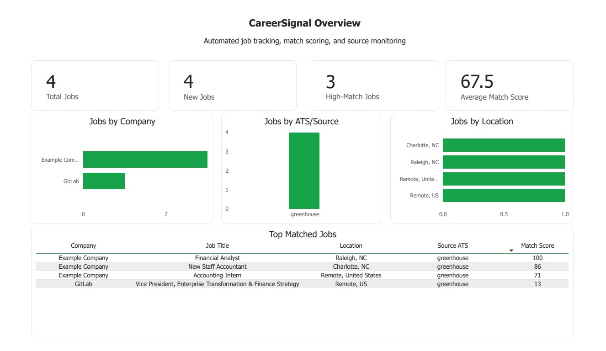

# CareerSignal

CareerSignal is a Python portfolio project that tracks job postings from target companies, scores jobs against target criteria, stores results in SQLite, exports clean Excel reports, sends daily email summaries, and powers a Power BI dashboard.

The project is designed to show practical automation, data handling, reporting, and business dashboard skills in one end-to-end workflow.

## Project Goal

CareerSignal helps job seekers monitor companies they care about instead of manually checking each career page every day.

The pipeline collects job postings, normalizes the data, stores jobs in a database, detects newly discovered jobs, scores each job for relevance, exports the results to Excel, and visualizes the output in Power BI.

## Current Features

- Company configuration stored in `config/company_config.csv`
- Greenhouse job collector
- Normalized job data format
- SQLite database storage
- Duplicate prevention using company, ATS source, and external job ID
- New job detection using first-seen and last-seen dates
- Match scoring system for job relevance
- Daily email report support
- Error handling and logging
- Excel export for reporting and dashboard use
- Power BI dashboard built from the Excel export

## Power BI Dashboard

CareerSignal includes a Power BI dashboard built from the Excel export generated by the Python pipeline. The dashboard summarizes total jobs collected, newly detected jobs, high-match opportunities, average match score, jobs by company, jobs by ATS/source, jobs by location, and top matched opportunities.



## Tech Stack

- Python
- SQLite
- Requests
- python-dotenv
- openpyxl
- Power BI
- Excel
- GitHub

## Project Structure

```text
CareerSignal/
├── config/
│   └── company_config.csv
├── data/
│   └── careersignal.db
├── docs/
│   ├── CareerSignal_Project_State.md
│   └── screenshots/
│       └── powerbi_overview_dashboard.png
├── exports/
│   └── careersignal_export.xlsx
├── logs/
│   └── careersignal.log
├── reports/
│   └── careersignal_dashboard.pbix
├── scripts/
│   ├── collect_greenhouse_jobs.py
│   ├── export_to_excel.py
│   ├── test_config_loader.py
│   ├── test_database.py
│   ├── test_email_report.py
│   └── test_match_scoring.py
├── src/
│   └── careersignal/
│       ├── __init__.py
│       ├── config_loader.py
│       ├── database.py
│       ├── email_report.py
│       ├── logging_config.py
│       └── match_scoring.py
├── tests/
├── .env.example
├── .gitignore
├── README.md
└── requirements.txt
```

Some local output files may not appear in GitHub if they are intentionally ignored, such as logs, environment files, or generated data files.

## Setup Instructions

### 1. Create and activate a virtual environment

```bash
python -m venv .venv
```

Windows Git Bash:

```bash
source .venv/Scripts/activate
```

Windows Command Prompt:

```cmd
.venv\Scripts\activate
```

### 2. Install dependencies

```bash
pip install -r requirements.txt
```

### 3. Configure environment variables

Copy `.env.example` to `.env` and fill in the required values.

```bash
cp .env.example .env
```

Do not commit `.env` to GitHub.

## Company Config

CareerSignal uses a CSV file to store target company information.

Config file location:

```text
config/company_config.csv
```

Current config fields:

- `company_name`
- `ats_type`
- `career_url`
- `target_locations`
- `keywords`
- `job_title_keywords`
- `excluded_keywords`
- `active`

The config loader is located here:

```text
src/careersignal/config_loader.py
```

To test the config loader:

```bash
PYTHONPATH=src python scripts/test_config_loader.py
```

Windows PowerShell:

```powershell
$env:PYTHONPATH="src"
python scripts/test_config_loader.py
```

The test should print companies marked as active in `company_config.csv`.

## Running CareerSignal

### Preview run

Use preview mode to collect jobs and print/report results without sending the real daily email.

```bash
python scripts/collect_greenhouse_jobs.py --preview
```

### Send daily report

Use send mode when you want to run the collector and send the real email report.

```bash
python scripts/collect_greenhouse_jobs.py --send
```

## Excel Export

CareerSignal exports job data to an Excel workbook for review and Power BI reporting.

Export file:

```text
exports/careersignal_export.xlsx
```

Run the export script:

```bash
python scripts/export_to_excel.py
```

The Excel export is used as the data source for the Power BI dashboard.

## Power BI Report

Power BI report file:

```text
reports/careersignal_dashboard.pbix
```

Dashboard data source:

```text
exports/careersignal_export.xlsx
```

After generating a fresh Excel export, open the Power BI report and click:

```text
Home > Refresh
```

This updates the dashboard with the latest exported job data.

## Database

CareerSignal uses SQLite for local job storage.

Database path:

```text
data/careersignal.db
```

The database stores job records, first-seen dates, last-seen dates, and run log data.

## Main Modules

### Database

```text
src/careersignal/database.py
```

Official database functions:

- `initialize_database()`
- `insert_or_update_jobs(jobs)`
- `get_all_jobs()`
- `get_jobs_first_seen_in_last_24_hours()`
- `insert_run_log(...)`

### Match Scoring

```text
src/careersignal/match_scoring.py
```

Official scoring function:

- `score_job(job)`

### Email Report

```text
src/careersignal/email_report.py
```

Official email report function:

- `build_and_send_daily_report(summary, new_jobs, failed_sources, test_mode=True)`

## Testing and Validation

Useful test commands:

```bash
PYTHONPATH=src python scripts/test_config_loader.py
PYTHONPATH=src python scripts/test_database.py
PYTHONPATH=src python scripts/test_match_scoring.py
PYTHONPATH=src python scripts/test_email_report.py
```

Windows PowerShell:

```powershell
$env:PYTHONPATH="src"
python scripts/test_config_loader.py
python scripts/test_database.py
python scripts/test_match_scoring.py
python scripts/test_email_report.py
```

## Current Status

CareerSignal currently has a working end-to-end pipeline:

1. Load active target companies from CSV
2. Collect jobs from Greenhouse
3. Normalize job records
4. Store jobs in SQLite
5. Detect newly discovered jobs
6. Score jobs for match quality
7. Log successful and failed runs
8. Export results to Excel
9. Send daily email reports
10. Display results in Power BI

## Future Improvements

- Add support for more ATS platforms
- Add scheduled automated runs
- Improve source health reporting
- Add more dashboard pages
- Add trend tracking over time
- Add richer match scoring rules
- Add more robust automated tests
- Package the project for easier setup