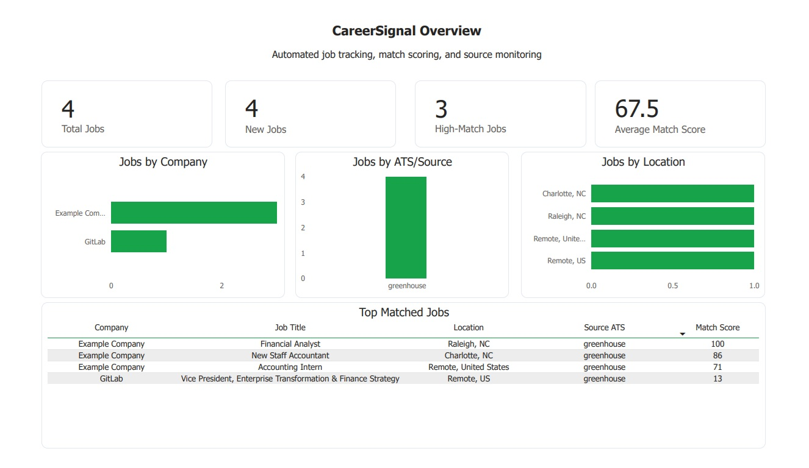
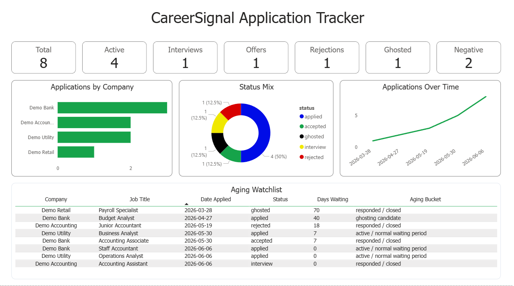
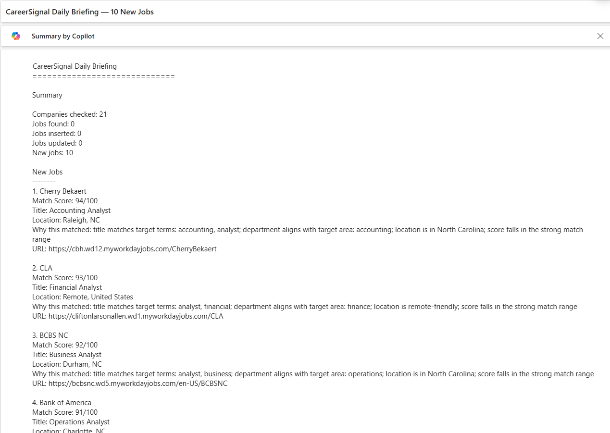
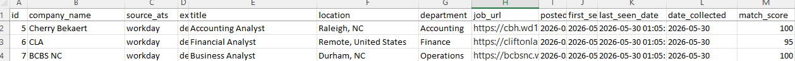
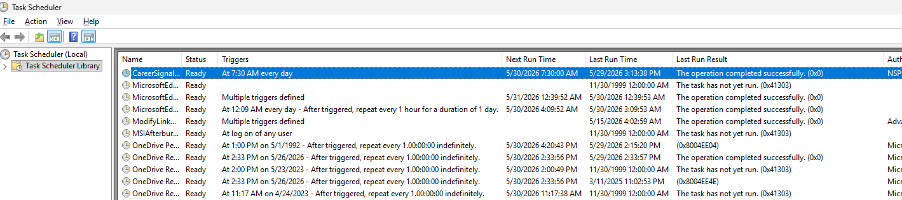

# CareerSignal

[](https://github.com/nepounds/CareerSignal/actions/workflows/tests.yml)

CareerSignal is a local Python/SQL career intelligence pipeline that monitors target company career pages, collects job postings, stores results in SQLite, scores job fit, sends daily email reports, exports Excel reports, supports Power BI dashboard reporting, and includes a manual Application Tracker dashboard.

The project was built as a portfolio project to demonstrate practical Python, SQL, automation, reporting, Power BI, and business analysis skills.

## Project Purpose

Most job searching is manual, repetitive, and easy to miss. CareerSignal was built to reduce that manual work by checking selected company career pages and surfacing roles that match a defined search strategy.

CareerSignal does not try to scrape every company on the internet. Instead, it uses a controlled company configuration file and supports only career platforms that the project can handle reliably.

The current job collection pipeline supports:

* Greenhouse
* Workday

Other ATS platforms and manual-only career pages are tracked in an ATS audit file for future improvement.

CareerSignal also includes a manual Application Tracker layer so job discovery and application follow-up can be tracked in the same reporting system.

## What CareerSignal Does

CareerSignal can:

* Read target companies from a CSV configuration file
* Collect jobs from supported Greenhouse and Workday career pages
* Normalize job data into a consistent format
* Store job records in a local SQLite database
* Avoid duplicate job records
* Track first-seen and last-seen dates
* Detect jobs first seen in the past 24 hours
* Score jobs based on target titles, keywords, locations, and role fit
* Send a daily job alert email report
* Include failed sources in the report
* Export job data to Excel
* Feed a Power BI dashboard
* Run automatically with Windows Task Scheduler
* Separate supported companies from unsupported/manual-only companies through an ATS audit
* Track manual job applications
* Update application statuses
* Report application totals, interviews, rejections, ghosting candidates, and outcomes
* Export Application Tracker sheets to the same Excel workbook
* Preview or send a separate weekly Application Tracker email
* Display Application Tracker visuals in Power BI
* Run automated tests and lint checks through GitHub Actions

## How It Works

```text
Windows Task Scheduler
→ run_careersignal_daily.bat
→ Python collection runner
→ Greenhouse / Workday collectors
→ normalized job records
→ SQLite database
→ new job detection
→ match scoring
→ daily email report
→ Excel export
→ Power BI dashboard
```

Application Tracker flow:

```text
manual application entry
→ applications table in SQLite
→ status updates
→ summary reporting
→ Excel export sheets
→ weekly Application Tracker email
→ Power BI Application Tracker dashboard
```

## Pipeline Overview

### 1. Company Configuration

The live company configuration is stored in:

```text
config/company_config.csv
```

This file includes only companies that CareerSignal is currently designed to collect from.

Current supported ATS types:

```text
greenhouse
workday
```

Unsupported platforms are intentionally kept out of the live config so the daily automation stays stable.

### 2. Job Collection

The main collection runner is:

```text
scripts/collect_greenhouse_jobs.py
```

The filename still references Greenhouse because the project started there, but the runner now supports both Greenhouse and Workday sources.

Preview mode:

```powershell
python scripts/collect_greenhouse_jobs.py --preview
```

Send mode:

```powershell
python scripts/collect_greenhouse_jobs.py --send
```

### 3. Data Normalization

Each collector returns jobs in a standard format:

```python
{
    "company_name": str,
    "source_ats": str,
    "external_job_id": str,
    "title": str,
    "location": str,
    "department": str,
    "job_url": str,
    "posted_date": str,
    "date_collected": str,
}
```

This lets the rest of the pipeline process Greenhouse and Workday jobs the same way.

### 4. SQLite Database

CareerSignal stores collected jobs and application records in:

```text
data/careersignal.db
```

The database supports:

* Job storage
* Duplicate prevention
* First-seen tracking
* Last-seen tracking
* New job detection
* Match scoring support
* Run logging
* Application tracking
* Excel and Power BI reporting

The project does **not** use:

```text
data/jobs.db
```

### 5. New Job Detection

CareerSignal tracks when each job was first seen.

The daily report is designed to focus on jobs first seen in the past 24 hours, instead of repeatedly sending the same jobs every day.

### 6. Match Scoring

CareerSignal scores jobs based on how well they fit the target search strategy.

The scoring system is not limited to accounting roles. It supports several realistic job lanes, including:

* Accounting roles
* Finance roles
* General analyst roles
* Business analyst roles
* Operations analyst roles
* Compliance analyst roles
* Data/reporting analyst roles
* Plant supervisor roles
* Operations supervisor roles
* Water/wastewater or utility-adjacent roles

Suggested score bands:

```text
80-100: Strong match
60-79: Possible match
40-59: Weak/stretch match
0-39: Low match or likely skip
```

### 7. Daily Email Report

CareerSignal can send a daily job alert email containing:

* Summary of the run
* Number of companies checked
* Number of jobs found
* Number of new jobs
* Match scores
* Why a job matched
* Job URLs
* Failed sources, if any

The email report is sent through SMTP using local `.env` settings.

The `.env` file is not committed to GitHub.

### 8. Application Tracker

CareerSignal includes a manual Application Tracker for recording jobs after applying.

Application Tracker data is stored in the same SQLite database:

```text
data/careersignal.db
```

Application Tracker table:

```text
applications
```

Application Tracker scripts:

```text
scripts/init_application_tracker.py
scripts/add_application.py
scripts/update_application_status.py
scripts/report_applications.py
scripts/send_weekly_application_tracker_email.py
```

Add an application:

```powershell
python scripts/add_application.py --company "RSM" --title "Audit Associate" --date-applied "2026-06-01"
```

Update an application status:

```powershell
python scripts/update_application_status.py --id 4 --status interview
```

View Application Tracker reporting:

```powershell
python scripts/report_applications.py
```

Preview the weekly Application Tracker email:

```powershell
python scripts/send_weekly_application_tracker_email.py --preview
```

Send the weekly Application Tracker email:

```powershell
python scripts/send_weekly_application_tracker_email.py --send
```

The weekly Application Tracker email is separate from the daily job alert email.

### 9. Excel Export

CareerSignal exports job and Application Tracker data to:

```text
exports/careersignal_export.xlsx
```

Export command:

```powershell
python scripts/export_to_excel.py
```

The Excel export is used as the Power BI data source.

Application Tracker sheets include:

* Applications
* Application Summary
* Company Application Summary
* Application Aging

### 10. Power BI Dashboard

The Power BI dashboard is stored in:

```text
reports/careersignal_dashboard.pbix
```

The dashboard uses:

```text
exports/careersignal_export.xlsx
```

The Power BI report includes:

* Job discovery overview
* Job collection/reporting visuals
* Application Tracker dashboard page
* Application status mix
* Application totals
* Application aging/watchlist reporting
* Application trends over time

Power BI Desktop requires manual refresh unless the report is published and configured for scheduled refresh separately.

Manual refresh:

```text
Home > Refresh
```

### 11. Daily Automation

CareerSignal can run automatically through Windows Task Scheduler.

The daily batch file is:

```text
run_careersignal_daily.bat
```

The scheduled task runs the collection script and Excel export so the pipeline can update daily without manually running each command.

There is also a weekly Application Tracker batch file:

```text
run_weekly_application_tracker_email.bat
```

That batch file can be used to send the weekly Application Tracker email. Scheduling it in Windows Task Scheduler is optional.

## Screenshots

Screenshots use sample/demo output generated from the CareerSignal pipeline. Private credentials, local database files, logs, and real email settings are excluded from the repository.

### Power BI Job Dashboard



### Application Tracker Dashboard



### Daily Email Report



### Excel Export



### Task Scheduler Setup



## Project Structure

```text
CareerSignal/
├── config/
│   ├── company_config.csv
│   ├── company_ats_audit.csv
│   ├── match_rules.json
│   └── workday_api_url_test_results.csv
├── data/
│   └── .gitkeep
├── docs/
│   ├── CareerSignal_Project_State.md
│   ├── filtering_strategy.md
│   └── screenshots/
│       ├── application_tracker_dashboard.png
│       ├── excel_export_sample.png
│       ├── powerbi_overview_dashboard.png
│       ├── sample_daily_email.png
│       └── task_scheduler_setup.png
├── exports/
│   └── .gitkeep
├── logs/
│   └── .gitkeep
├── reports/
│   └── careersignal_dashboard.pbix
├── .github/
│   └── workflows/
│       └── tests.yml
├── scripts/
│   ├── add_application.py
│   ├── add_match_scoring_columns.py
│   ├── check_application_tracker.py
│   ├── check_generated_workday_api_urls.py
│   ├── collect_greenhouse_jobs.py
│   ├── export_ready_companies_to_config.py
│   ├── export_to_excel.py
│   ├── generate_company_config_from_audit.py
│   ├── init_application_tracker.py
│   ├── init_database.py
│   ├── preview_workday_jobs.py
│   ├── preview_workday_normalized_jobs.py
│   ├── report_applications.py
│   ├── send_weekly_application_tracker_email.py
│   ├── show_applications.py
│   ├── test_config_loader.py
│   ├── test_database.py
│   ├── test_email_report.py
│   ├── test_job_normalizer.py
│   ├── test_match_scoring.py
│   ├── test_new_job_detection.py
│   ├── update_application_status.py
│   ├── update_match_scores.py
│   ├── verify_ats_audit.py
│   └── view_database.py
├── src/
│   └── careersignal/
│       ├── __init__.py
│       ├── application_tracker.py
│       ├── application_tracker_db.py
│       ├── config_loader.py
│       ├── database.py
│       ├── email_report.py
│       ├── job_normalizer.py
│       ├── logging_config.py
│       ├── main.py
│       ├── match_scoring.py
│       └── collectors/
│           ├── __init__.py
│           ├── greenhouse.py
│           └── workday.py
├── tests/
│   ├── .gitkeep
│   ├── test_email_report.py
│   └── test_match_scoring.py
├── run_careersignal_daily.bat
├── run_weekly_application_tracker_email.bat
├── .env.example
├── .gitignore
├── pyproject.toml
├── README.md
└── requirements.txt
```

## Setup

### 1. Clone the repository

```powershell
git clone <repository-url>
cd CareerSignal
```

### 2. Create a virtual environment

```powershell
python -m venv .venv
```

### 3. Activate the virtual environment

```powershell
.\.venv\Scripts\Activate.ps1
```

### 4. Install dependencies

```powershell
pip install -r requirements.txt
```

### 5. Create a local `.env` file

Copy the example file:

```powershell
copy .env.example .env
```

Then update `.env` with local email settings.

Do not commit `.env`.

### 6. Set `PYTHONPATH`

```powershell
$env:PYTHONPATH="src"
```

## Common Commands

Run config loader test:

```powershell
python scripts/test_config_loader.py
```

Run database test:

```powershell
python scripts/test_database.py
```

Run match scoring test:

```powershell
python scripts/test_match_scoring.py
```

Run email report test:

```powershell
python scripts/test_email_report.py
```

Preview collection without sending email:

```powershell
python scripts/collect_greenhouse_jobs.py --preview
```

Run collection and send daily email:

```powershell
python scripts/collect_greenhouse_jobs.py --send
```

Export to Excel:

```powershell
python scripts/export_to_excel.py
```

Preview weekly Application Tracker email:

```powershell
python scripts/send_weekly_application_tracker_email.py --preview
```

Send weekly Application Tracker email:

```powershell
python scripts/send_weekly_application_tracker_email.py --send
```

Add an application:

```powershell
python scripts/add_application.py --company "RSM" --title "Audit Associate" --date-applied "2026-06-01"
```

Update an application status:

```powershell
python scripts/update_application_status.py --id 4 --status interview
```

Run Application Tracker report:

```powershell
python scripts/report_applications.py
```

Run the daily automation manually:

```powershell
.\run_careersignal_daily.bat
```

Run the weekly Application Tracker batch file manually:

```powershell
.\run_weekly_application_tracker_email.bat
```

Check logs:

```powershell
Get-Content .\logs\careersignal.log -Tail 100
Get-Content .\logs\scheduled_task.log -Tail 100
Get-Content .\logs\weekly_application_tracker_email.log -Tail 100
```

Run pytest unit tests:

```powershell
$env:PYTHONPATH="src"
pytest tests
```

Run Ruff lint checks:

```powershell
ruff check src scripts tests
```

## Testing and Code Quality

CareerSignal includes a small pytest test suite and a GitHub Actions workflow.

The tests currently cover:

* Match scoring behavior
* Email subject generation
* Email body generation
* Failed-source reporting in the daily email

The project also uses Ruff for linting. Ruff checks the code for simple quality issues such as unused imports, syntax problems, and basic cleanup items.

GitHub Actions runs both checks automatically on push and pull request:

```text
ruff check src scripts tests
pytest tests
```

This helps confirm that the project can be checked outside the local development machine and that future changes do not break the core tested behavior.

## ATS Audit

CareerSignal includes an ATS audit file:

```text
config/company_ats_audit.csv
```

The audit file tracks companies beyond the live config, including companies that are not currently supported by the automated pipeline.

The audit separates companies into categories such as:

```text
ready_now
future_connector
manual_only
needs_review
skip
```

### Status Meanings

| Status           | Meaning                                                                     |
| ---------------- | --------------------------------------------------------------------------- |
| ready_now        | Supported by the current Greenhouse/Workday pipeline                        |
| future_connector | Known ATS, but not currently supported                                      |
| manual_only      | Useful company, but no reliable automated source yet                        |
| needs_review     | Requires more URL or ATS verification                                       |
| skip             | Not currently useful, acquired, irrelevant, broken, or not worth monitoring |

This audit prevents unsupported or unreliable companies from being forced into the live daily automation.

## Audit Utilities

CareerSignal includes helper scripts for maintaining the ATS audit and generating the live company config.

### Verify ATS Audit

```text
scripts/verify_ats_audit.py
```

This script checks career URLs and attempts to detect ATS platforms.

It is useful for identifying obvious platform mismatches, but it is not perfect. Some sites block automated requests, and some Workday pages return errors even when the company is truly using Workday.

### Generate Company Config from Audit

```text
scripts/generate_company_config_from_audit.py
```

This script creates a live config candidate from audit rows marked:

```text
ready_now
```

and ATS types currently supported by CareerSignal:

```text
workday
greenhouse
```

This keeps the official config clean and avoids manual copy/paste errors.

## Design Decisions

### Live Config and Audit Are Separate

CareerSignal intentionally separates the live company config from the broader ATS audit.

The live config contains only companies that the current pipeline can attempt to collect from.

The audit file can include unsupported ATS platforms, custom career pages, proprietary portals, email-only application pages, skipped companies, and companies that need more review.

This keeps the automated daily run stable while still preserving research for future expansion.

### Supported Connectors Are Limited on Purpose

CareerSignal currently supports Greenhouse and Workday.

The ATS audit showed that many employers use unsupported, proprietary, or manual-only systems. Instead of trying to force every company into the pipeline, CareerSignal separates those companies into future connector or manual-monitor categories.

Future connector work should be prioritized based on audit counts and target-company value, not random guessing.

### Application Tracking Is Kept Separate from Job Collection

The automated job collector finds and reports new job postings.

The Application Tracker records applications after they have been submitted manually.

Keeping these separate prevents the daily job alert pipeline from accidentally changing application statuses or mixing job discovery data with application outcome data.

### The Project Uses Local Files Intentionally

CareerSignal uses local SQLite, Excel, and Power BI files because the goal is to demonstrate a practical, understandable portfolio pipeline.

The project is intentionally local-first rather than cloud-first.

## Strengths of the Project

CareerSignal demonstrates more than basic Python scripting.

Key strengths:

* End-to-end pipeline design
* CSV-based configuration
* Greenhouse and Workday collection support
* Normalized job data
* SQLite database storage
* Duplicate prevention
* New job detection
* Match scoring
* Daily email reporting
* Error handling and logging
* Excel export
* Power BI dashboard integration
* Manual Application Tracker
* Application status updates
* Application outcome reporting
* Weekly Application Tracker email
* Windows Task Scheduler automation
* ATS audit and source triage
* Separation between production-ready sources and unsupported/manual sources
* Separation between job discovery and application tracking
* Pytest unit tests for core behavior
* GitHub Actions CI workflow
* Ruff linting for code quality checks

A major strength of the project is that it deals with messy real-world data instead of assuming every company has a clean, scrapeable careers page.

The ATS audit became an important part of the project because it showed which companies could be automated now, which companies need future connector support, and which companies should stay manual.

## Current Limitations

CareerSignal is functional, but it has limitations.

Current limitations:

* Only Greenhouse and Workday are supported for automated job collection.
* Many target companies use unsupported ATS platforms.
* Some companies use proprietary portals or email-only application pages.
* Workday URLs can require manual review because Workday career sites vary by company.
* Power BI Desktop requires manual refresh unless the report is published and configured separately.
* The project is local-first and not deployed as a hosted application.
* The Application Tracker is manual and does not yet automatically change statuses based on age.
* The test suite covers key behavior, but it does not yet cover every collector, database edge case, or reporting path.
* Some ATS audit results still require manual verification.

These limitations are expected for a portfolio version of the project and are documented so future improvements are clear.

## Future Improvements

Planned future improvements are intentionally limited to the next useful upgrades.

### Application Dashboard

* Change application status updates to auto-update based on days since applying.

### Job Scraper

* Add extra ATS connectors for ATS platforms used by more than five target companies.
* Fix broken Workday links.

## GitHub Safety

The repository should not include:

```text
.env
.venv/
data/careersignal.db
exports/careersignal_export.xlsx
logs/
email passwords
SMTP credentials
private exports
temporary backup files
local cache files
```

The repository can safely include:

```text
README.md
requirements.txt
.env.example
.gitignore
pyproject.toml
run_careersignal_daily.bat
run_weekly_application_tracker_email.bat
config/company_config.csv
config/company_ats_audit.csv
config/match_rules.json
docs/
reports/careersignal_dashboard.pbix
.github/workflows/tests.yml
scripts/
src/
tests/
```

## Final Project Summary

CareerSignal is a local Python/SQL pipeline for automated job discovery, application tracking, and reporting.

The project’s strongest value is not just that it collects jobs. It also shows how to deal with messy real-world source systems, separate reliable automation from unreliable inputs, track follow-up after applying, and turn raw job/application data into useful reporting.

The current version is intentionally scoped to Greenhouse and Workday for job collection, with a documented path for future ATS connectors and Workday link cleanup.
